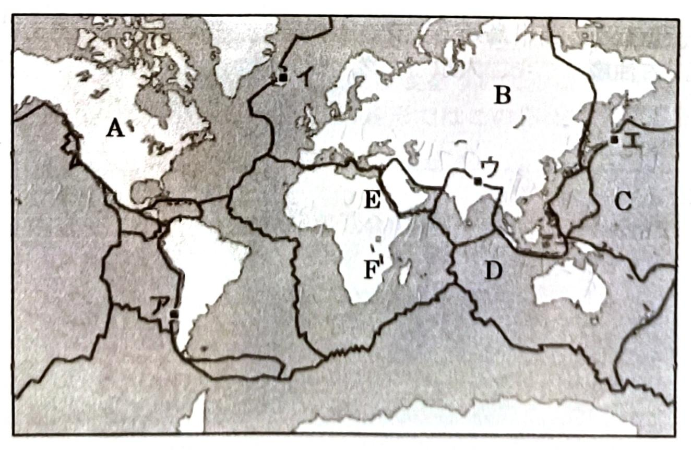

# 2年地理総合 1学期中間試験

- 監督者の指示があるまで開かない。
- 漢字で答えるべきは漢字を使うこと。
- 問題用紙は6ページあります。

# **1**

> **高校生の南花子さんは、夏休みに海外旅行に行くことになりました。地理の授業で学んだ知識を生かして有意義な旅行にしようと努力しました。その旅行についての文を読み各問いに答えなさい。**
> 

花子さんは羽田空港を、8月1日10時に出発するJAL045便に乗り、パリに向け出発しました。パリまでの飛行時間は14時間30分です。本来はパリ行きの飛行時間はおおむね12時間くらいですが、**a 2022年2月のある出来事**から、日本からヨーロッパへ向かう航空機の飛行ルートは大きく迂回することを余儀なくされて、長い飛行距離となっています。この飛行時間とパリの経度から花子さんは、**b パリのシャルル=ド=ゴール(CGD)到着の日時**を考えました。また**c 航空機で目的地に向かう際の航路図に最適な地図の図法**はと考えた時、地理の授業で学習したある図法が浮かびました。

長時間のフライトを初めて経験し、パリ空港に着いた花子さんは、宿泊費を除く行動費にお年玉を貯めた6万円を持ってきました。さっそく空港の両替所で現地の通貨**(　1　)**と交換したところ、現地通貨で約**(　2　)**で、意外と少なく感じ、旅行の日々で大切に使おうと思いました。

翌日、花子さんは世界でも有数の規模を誇る**(　3　)**美術館に向かい、ほぼ一日滞在してミロのヴィーナスやレオナルド=ダ=ヴィンチの作品『モナ=リザ』などを鑑賞して感激しました。そしてパリ最終日は行きたかったパリ市内を一望できるエッフェル塔にのぼり、パリの街の美しさに思わず嘆息しました。このエッフェル塔は、1889年「フランス革命100年」を記念して開催されたパリ**(　4　)**時の建設物であることを思い出しました。

旅行4日目、花子さんはイタリアに移動することになりました。パリ市内のオルリー空港からイタリア北部にある大都市ミラノまで航空機で移動し、この日はホテルで早めに休みました。ミラノはアルプスの麓にある都市ですが、さらにアルプスの山中にある街**(　5　)**と、**d 2026年に世界的なイベントを開催する**ためか、街には活気がありました。翌日、鉄道でフィレンツェに移動した花子さんは、ルネサンス期の作品が多く展示される**(　6　)**美術館を一日中鑑賞して、絵画や彫刻の素晴しさに触れて感動しました。翌日は歴史的建造物の多いフィレンツェの街を散策したのち、ミラノまで戻りました。今まで日本の都市とイタリア北部の都市との直行便はなく不便でしたが、ミラノと羽田空港との直行便が2024年12月に開設されたので、その便であるANA206便で帰国の途に就き、家族の待つ羽田空港に帰ってきました。

## **問1**

> **文中(　1　)~(　6　)に入る適切な語句を答えなさい。ただし、(　2　)の問いには、現地通貨の金額を数日来で最も近いレートの金額を、下の記号から選びなさい。**
> 

選択群

ア、170　イ、270　ウ、370　エ、470

---

※金額はおおよそである

## **問2.文中の下線部a〜dについて、問いに答えなさい。**

- a.この出来事を答えなさい。
- b.花子さんがパリのCDG空港に到着したのは何月何日の何時ですか。

> ※実際、この時期はサマータイムであるが、サマータイムは考慮しない。
> 
- c.この図法名を答えなさい。
- d.この世界的なイベント名を答えなさい。

# **2**

**世界と日本の地理的な基本事項について問いに答えなさい。**

1. 地球の赤道周と赤道における半径をともに答えなさい。(完答)
2. NYにある「自由の女神」はフランスからのプレゼントであるが、贈られた理由は何か。
3. 米トランプ大統領が取得をめざすグリーンランドはどこの国の自治領か。
4. 韓国の出生率(合計特殊出生率)は日本の1.26より低い。韓国の出生率を答えなさい。
5. 次の2つに該当する都道府県名を答えなさい。「平均標高が2番目に高い」「平均標高が2番目に低い」

# **3.地球の規模について、次の文を読み各問いに答えなさい。**

私たちの住む地球は球体であるが、わずかに楕円形となっている。地球の表面積は(　1　)km2であり、海洋が(　2　)%、陸地の面積は約(　3　)km2である。陸地の面積を球体で表現した時にそれが最大となる地点を陸半球といい、その中心地点は(　4　)のナントの付近であり、水半球はニュージーランドのアンティポーディーズ諸島がそれにあたる。また陸地の３分の2は(　5　)に偏っている。

人々の生活は、土地の高低や起伏といった地形と関わり合いながら成立している。私たちの生活の舞台となっている陸地の大部分の高度は1000m以下であり、平均高度は(　6　)mである。陸地の最高地点はヒマラヤ山脈のエベレスト山の8848mであり、海洋の最深部はマリアナ海溝の(　7　)海淵であり、陸地と海洋の最深部との高低差は(　8　)mである。

世界地図で陸地を眺めてみると、巨大山脈は多くが大陸の縁辺部に分布しており、太平洋の西岸部には**a 弧状列島**が多いのがわかる。また海底には**b 海嶺**といわれる大地形の一つがある。

## **問1.文中(　1　)〜(　8　)に入る適切な語句を答えなさい。**

## **問2.文中の下線部 a, bについて、問いに答えなさい。**

- a.これと並行にあるものは何か答えなさい。
- b.これは何か答え、また単体であるものの名称も答えなさい。(完答)

# **4.地形を作り変化させる力について、次の各問いに答えなさい。**

## **問1.地形を作る力である営力に関する、次の表中(　1　)~(　5　)に入る適切な語句を答えなさい。**

| 外的営力 | (　1　)エネルギーが起源となった、地表の外側からの力。空気・水の動き、緑川の流れ、波、風などによる(　2　)や風化・運搬・(　3　)など |  |
| --- | --- | --- |
|  | 内的営力によりできた地球表面の凹凸をなくす力(運動) |  |
| 内的営力 | 造山運動 | 「山地を造る運動=地殻変動」褶曲運動や(　4　)をともなって山地を形成。**a.新期造山帯**と**b.古期造山帯**に大別される |
|  | 造陸運動 | 陸地を造る運動→　広い範囲でおこる地殻変動であり隆起や沈降による |
|  | 火山活動 | (　5　)がほぼ真上に上昇して噴火を引き起こし、火山を形成する活動。火山は人間に恵みをもたらす反面、大きな**c.火山災害**をもたらす |

## **問2.表中の下線部 a,b について、問いに答えなさい。**

### **a.新期造山帯にあてはまるものを、次のア〜カの中から3つ選びなさい。(完答2点)**

- ア：鉱産資源としては「銅」、化石燃料としては「石油」の埋蔵量が多いところとされる。
- イ：起伏が比較的少なく、人間の生産活動や交通の障害になることは少ない。
- ウ：バリスカン造山運動、カレドニア造山運動などがこれにあたる造山運動である。
- エ：日本列島はこの造山帯上にあり、地震や火山が多いが、パプアニューギニアも同様である。
- オ：起伏が大きく人間の生産活動や交通障害となるため文化圏の境となる例が多い。
- カ：古生代に大褶曲山脈となり、その後長い期間侵食されなだらかな山容となった。

### **b.古期造山帯にある次の1~3の山脈がある国名を答えなさい。複数の国にまたがる場合は1国だけでも正解とします。(完答2点)**

1. ペニン山脈
2. アパラチア山脈
3. スカンディナヴィア山脈

## **問3.表中下線部c.火山災害について、次の対応についての文を読み、A, Bの問いに答えなさい。(各2点)**

### **A**

富士山の大噴火に備え、内閣府の有識者検討会は3月21日、灰の積もる量などに応じて地域の危険度を4段階に分け、非難の必要性を示す初の指針案をまとめた。降灰の影響で首都圏でも停電や交通、通信の乱れなど、都市機能の麻痺が想定され、「自宅で生活を続ける」を基本としつつ、降灰量が30以上になれば命の危険があり、原則避難を求める。

富士山は過去5600年に約180回の噴火があった活火山だが、江戸にも降灰をもたらした宝永噴火(1707年)を最後に、噴火は確認されていない。

政府の中央防災会議は2020年、同程度の大噴火が起きた場合、東京都新宿区付近で3%以上、相模原付近で30%以上など福島から静岡まで11都道府県に降灰があるとする予測を公表。富士山から離れた地域でも大規模な鉄道の運行停止や、停電や通信障害、上下水道の使用制限なども想定され、今回は住民の対応策などを初めて示した。

問A：宝永噴火と同程度の大噴火が起きた際に想定されることして誤っているものはどれか。

1. 静岡県から福島県まで11都府県で火山灰が降る
2. 首都圏でも鉄道の運行停止や停電などが起こる
3. 新宿など東京都心でも避難が求められる
4. 富士山に近い地域では、降灰量が30cmを超える

---

### **B**

指針案は降灰量や物資の輸送に使う道路の状況によって、地域をステージ1~4に分けた。ステージ4(30cm以上)は原則避難で、降雨時は木造家屋の倒壊の可能性もある。降灰量が30cm未満では「できる限り自宅等で生活を継続することが基本」としつつも、ステージ3(3cm以上30cm未満)は道路の除灰が追いつかず物流に影響が生じ、生活物資の入手が困難な状況も想定される。平時からの備蓄の重要性を呼びかけ、噴火の兆候があれば、事業者はテレワーク体制の確認などを求める。

火山灰は直径2mm以下と細かく、風で遠くまで飛ぶ。防災科学技術研究所の宮城洋介主任研究員は「ガラス片を含んで硬く、角ばっていて、車のワイパーを動かすとフロントガラスを傷つけ、目に入ると角膜を傷つける」と指摘する。雨などで水分を含むと粘り気が強くなり、10mm以上積もれば四輪駆動車も走行不能になり、滑走路が閉鎖されれば、航空機も使えない。特に鉄道はレールに数mmでも積もっただけでも走行できず、首都圏の交通網に大打撃を与える可能性がある。

問B：火山灰に関する文章(記事)の内容として正しいものはどれか。

1. レールの上を走る鉄道は、自動車に比べて火山灰に強い
2. 道路の除灰が追いつかないステージ3では、避難が求められる
3. ガラス片を含む火山灰は重く、飛散しにくい性質がある。
4. ステージ3では、物流が滞るおそれがあるため、備蓄が必要だ

---

※文章：朝日新聞2025年4月28日朝刊「ニュースでメキメキ読み解く力」より

# **5.変動帯について、Ⅰ、Ⅱの各問いに答えなさい。**

## **Ⅰ：次の文を読み問いに答えなさい。**

世界の大地形は、地震活動や地殻変動が活発で、巨大な山脈や活断層、火山などが分布する変動帯と、それ以外の地震・火山活動が(　1　)な安定地域があり、特徴が大きく異なる。

地球の表面は厚さ約100km程度の固い岩石でできたプレートに覆われている。変動帯はプレートの境界に沿って広がりプレートの運動と密接に関連している。プレートはおよそ15枚といわれ、プレートのある位置から(　2　)プレートと、密度が大きく重い(　3　)プレートに分けられる。

地殻変動や地震火山活動と、これらによる大地形の発達は、プレートの動きが原因で生じると考えられる。これは20世紀初頭に、ドイツの気象学者(　4　)が提唱した考え方である。大西洋をはさみ、(　5　)大陸西岸と(　6　)大陸東岸の海岸線の形状が似ていることに注目し、(　7　)を唱えた。古生代には超大陸が存在し、中生代に分裂を始め、その後は離合集散を繰り返し、現在の大陸分布に至ったという仮説である。

彼は**b.大陸を動かす原動力**を説明できなかったため、発表当時は受け入れられなかったが、1968年にカナダの(　8　)により理論が完成され、1970年代からこの理論が認められた。これは(　9　)理論という。

### **問1.上の文中(　1　)~(　9　)に入る適切な語句や人物名を答えなさい。**

### **問2.右図は文中下線部a.の超大陸を表している。この大陸名を答えなさい。(2点)**

### **問3.文中下線部b.「大陸を動かす力」は、現在では何と考えられているか。(2点)**

## **II：変動帯はプレートの境界でもある。プレートと境界について、次の問いに答えなさい。**

### **問1. 下の図中の太線は、主なプレートの境界の位置を表しており、ア~エはプレート境界の地域海域を示している。ア~エの境界が、a「広がる境界」・b「狭まる境界」・c「ずれる境界」のどれに該当するか、 a, b, c の記号で答えなさい。該当するものがない場合は☓で答えなさい。**

### **問2.下の図中A~Dの記号があるプレート名を答えなさい。**

### **問3**

1. 図中のE~Fには南北に約6000kmに及ぶ大きなくぼ地が形成されている。これを何というか。
2. この地域で見られる湖の形状を地形学上何というか答えなさい。

### **問4.図中のア~エのプレート地域海域を説明する文として、正しいものに◯、誤りを含むものは☓で答えなさい。**

- ア、このプレートの境界付近では、海溝付近を震源とする地震が多く発生する。
- イ、このプレートの境界付近では、海嶺の一部が海上に現れて火山島になった。
- ウ、このプレートの境界付近では、プレートの衝突により形成された、比較的なだらかな山脈がある。
- エ、このプレートの境界付近では、並行する島弧において地震が多く発生する。

### **問5.ずれる境界で見られるトランスフォーム断層がアメリカのカリフォルニア州でみられるが、その断層名を答えなさい。**

# **6.「地質時代の区分」について、下の表中の(　A　)の時代名と(　1　)~(　6　)に入る語句を、下の語群から記号を選び答えなさい。Aには選択肢はない。**

| 地質時代 |  | 年代 | 事項 |
| --- | --- | --- | --- |
|  |  |  |  |
|  |  | 46億年前 | 微生物の誕生 |
| (　A　)時代 |  |  |  |
|  |  |  | 酸素濃度の上昇 |
|  |  | 5.4億年前 | (　1　)の形成 |
| 古生代 |  |  | 陸上動植物の出現
(　2　)の形成 |
| 中生代 |  |  | シダ類と(　3　)の時代 |
| 新生代 | 古第三期 | 6600万年前 | (　4　)の多様化 |
|  | 新第三期 | 2300万年前 | 大陸氷河の出現
(　5　)の誕生 |
|  | 第四期 | 260万年前 | (　6　)時代
人類の進化と拡散 |

語群

ア、魚類　イ、鳥類　ウ、石炭層　エ、氷河　オ、天然ガス層

カ、石油層　キ、人類　ク、哺乳類　ケ、鉄鉱床　コ、恐竜

# 7.安定地域の平野と生活について、次の文を読み、次の各問いに答えなさい。

変動帯がプレート境界を中心とした帯状の地域であるの対して、安定地域はプレートの(　1　)の大部分である。この地域はプレートから離れていて「大陸の(　2　)や合体」の影響をほとんど受けていない安定地域である。安定地域で最も古い陸地は(　3　)とよばれ、大陸の多くの部分を占めている。この地域は長い間、(　4　)を受け低平な侵食平野などを形成している。またこの地域は、(　5　)がほとんど起きていない安定した陸地であり、その地質構造から楯状地と卓状地の2つに大きく2つに区分される。カナダ楯状地は古い地層が広範囲に露出して平坦地である。高緯度に位置する北米の**a.ハドソン湾周辺**やユーラシア大陸のロシアには(　6　)周辺は氷期に氷河によって地表が削られ、氷河が融解した現在では古い地層が露出している。**b.このような場所では住宅の材料として石材が利用されることがある**。

## 1.上の文中(　1　)~(　6　)に入る適切な語句を答えなさい。

## 2.文中下線部a・bについて問に答えなさい。(各2点)

- a.周辺に見られる卓状地の名称を答えなさい。
- b.これに関連して、最も古い時代の地層のあるオーストラリアやブラジルにはある鉱床が広く分布していて工業製品に利用されている。この鉱産資源名を答えなさい。

## 問3.下の図は卓状地でみられる地形の模式図である。この地形に関して1~3の問いに答えなさい。

1. D・E・Fの地形の名称をそれぞれ答えなさい。
2. D,Eの地形がみることができる、アメリカのアリゾナ州からユタ州にかけての地域名を答えなさい。
3. Fの地形に関する次の説明文を読み、A~Cの項目の組み合わせで、正しいものをア~カから1つ選び答えなさい。

地盤がわずかに傾き、軟硬のある地層が不均一に侵食をうけて形成された地形で、一方に急崖、反対側に緩やかな傾斜の斜面となっている。この地形ではこの地域の気候にあった果樹が栽培されている。

---

- A.パリ盆地が有名である
- B.ブドウ栽培が見られる
- C.日本の甲府盆地も同じ地形である

|  | A | B | C |
| --- | --- | --- | --- |
| ア | 正 | 正 | 正 |
| イ | 正 | 正 | 誤 |
| ウ | 正 | 誤 | 正 |
| エ | 誤 | 正 | 正 |
| オ | 誤 | 誤 | 正 |
| カ | 誤 | 正 | 誤 |